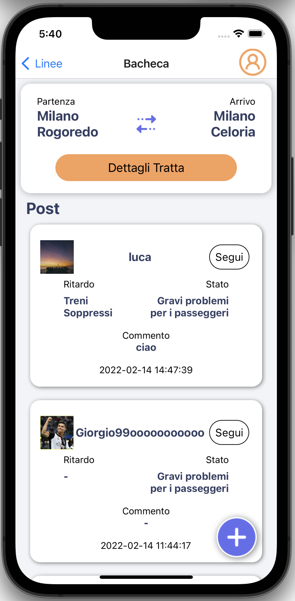
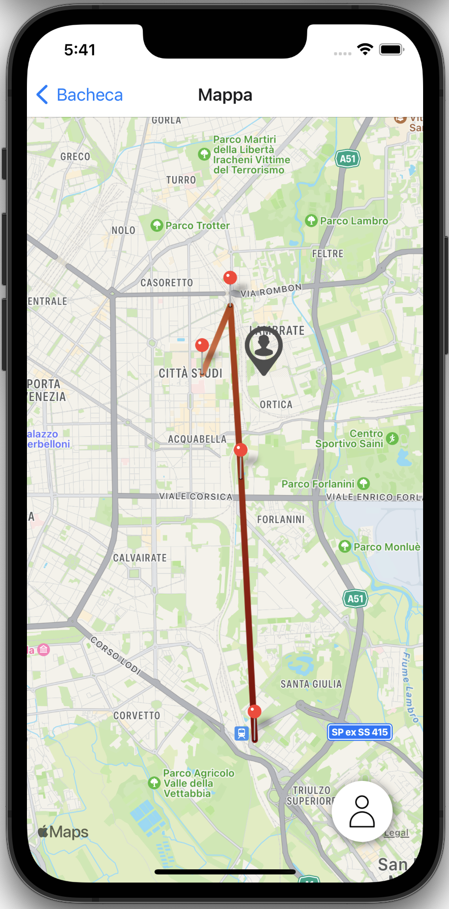
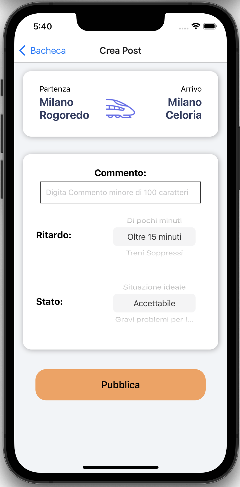

# App Cross Platform - MaledettaTreEst
### *Cross-Platform Project of the 2021/2022 Mobile Computing Course*

The app wants to reproduce the experience of a social network for reporting delays/ problems of the railway transport service of the company TreEst.
The user can choose a line and a route to see the posts posted by the users in the relevant bulletin board.
From each post, the user can choose whether to start following the author. The posts of the followed users will be highlighted in the bulletin board.
You can also create posts and edit your profile in the app (username and profile picture).
From the bulletin board you can also view the map with all the stations of the line and the current location of the user.

---
<div align="center">
    
    
    
</div>

---
To make the development of the prototype fast and without any particular problems, the tool was used [Expo](https://expo.dev/).

To start the app locally just run from the command line

```bash
npm start
```
Then launch a simulator and start the app from expo